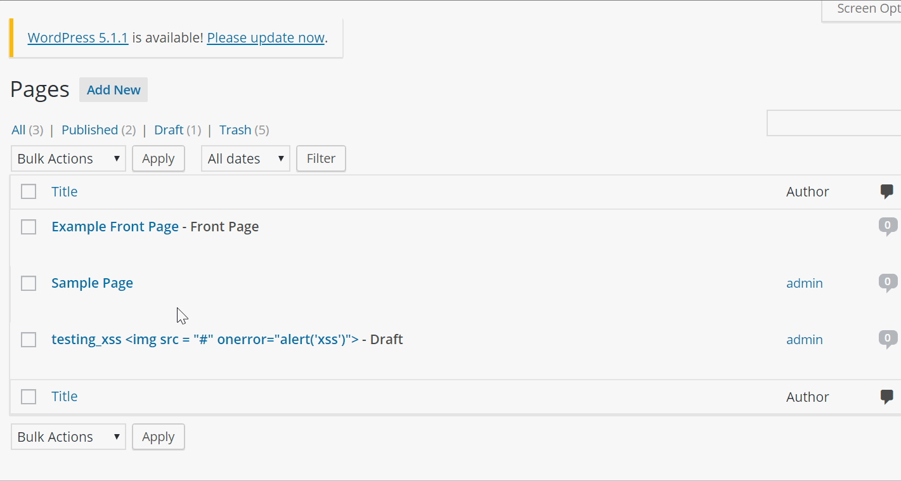

# CyberSecurity-Codepath

Assignment -7,8

Xploits:

1) Vulnerability Name or ID : USER Enumeration

Summary: This exploit allowes user to enumerate through different user names, I tested with multiple non-existing usernames, and extisting usernames. Upon knowing the valid username or usernames, it is easier to perfrom bruteforce attack.
Vulnerability types: User enumeration
Tested in version: 4.2

2)Vulnerability XSS

Summary: Admin can run XSS on the page
Vulnerability types: XSS
Tested in version: 4.2
Fixed in version: 4.6.1

 
