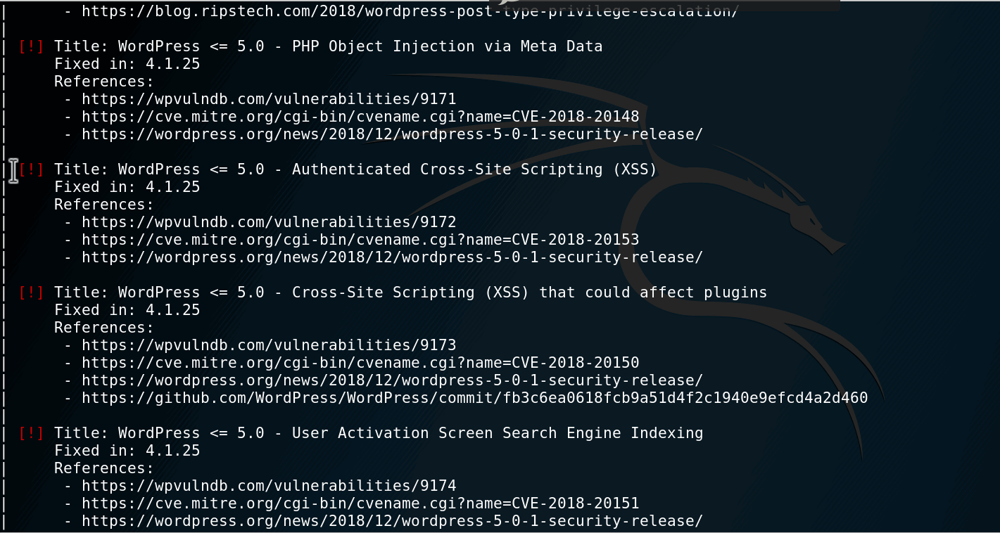
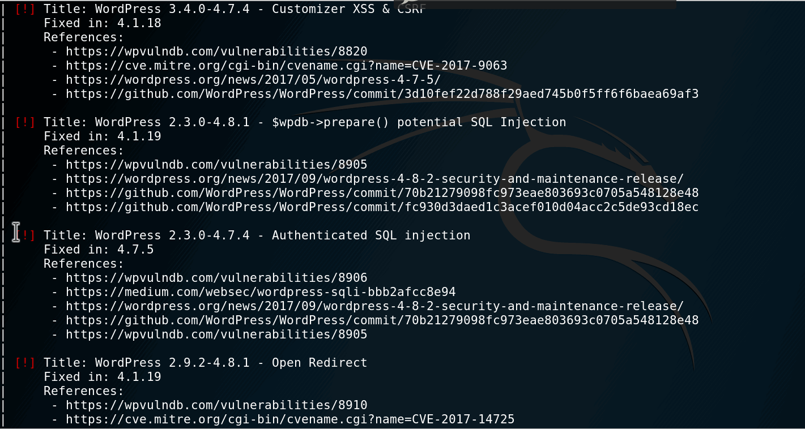
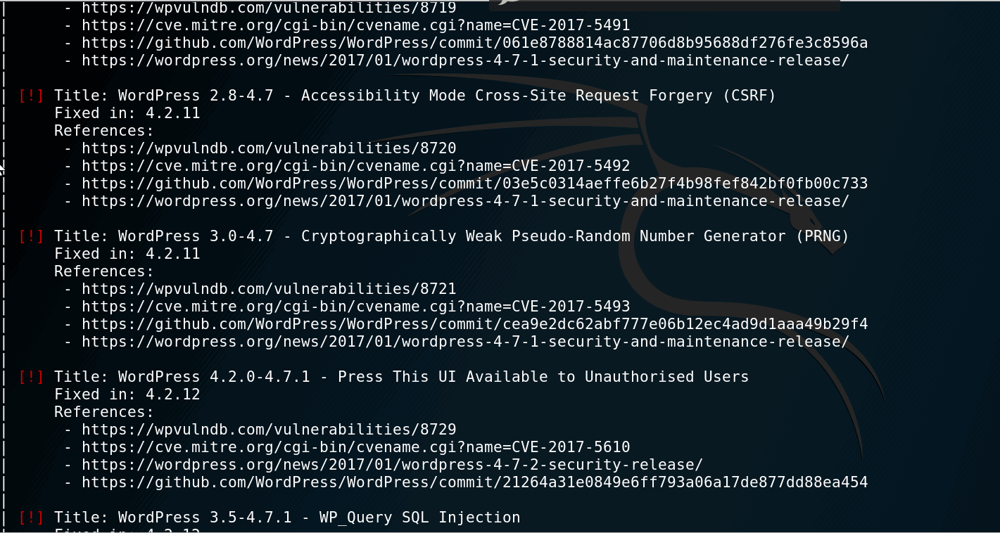
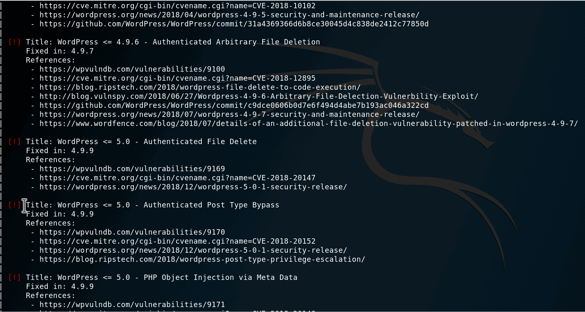

# CyberSecurity-Codepath

Assignment -7

Step: 1) Changed the wordpress version to 4.1
      2) Run vagrant up
      3) Back in Kali VM, run "wpscan --url http://wpdistillery.vm"
      4) We will find exploits
Xploits:

1) XSS:

Title: WordPress <= 5.0 - Authenticated Cross-Site Scripting (XSS)
        Fixed in: 4.1.25
        References:
  - https://wpvulndb.com/vulnerabilities/9172
  - https://cve.mitre.org/cgi-bin/cvename.cgi?name=CVE-2018-20153
  - https://wordpress.org/news/2018/12/wordpress-5-0-1-security-release/

2) SQLI:

Title: WordPress 2.3.0-4.7.4 - Authenticated SQL injection
 |     Fixed in: 4.7.5
 |     References:
 |      - https://wpvulndb.com/vulnerabilities/8906
 |      - https://medium.com/websec/wordpress-sqli-bbb2afcc8e94
 |      - https://wordpress.org/news/2017/09/wordpress-4-8-2-security-and-maintenance-release/
 |      - https://github.com/WordPress/WordPress/commit/70b21279098fc973eae803693c0705a548128e48
 |      - https://wpvulndb.com/vulnerabilities/8905

 
 3) CSRF:
 
 Title: WordPress 2.8-4.7 - Accessibility Mode Cross-Site Request Forgery (CSRF)
 |     Fixed in: 4.1.14
 |     References:
 |      - https://wpvulndb.com/vulnerabilities/8720
 |      - https://cve.mitre.org/cgi-bin/cvename.cgi?name=CVE-2017-5492
 |      - https://github.com/WordPress/WordPress/commit/03e5c0314aeffe6b27f4b98fef842bf0fb00c733
 |      - https://wordpress.org/news/2017/01/wordpress-4-7-1-security-and-maintenance-release/

4) User Enumeration :

 Title: WordPress <= 5.0 - User Activation Screen Search Engine Indexing
 |     Fixed in: 4.9.9
 |     References:
 |      - https://wpvulndb.com/vulnerabilities/9174
 |      - https://cve.mitre.org/cgi-bin/cvename.cgi?name=CVE-2018-20151
 |      - https://wordpress.org/news/2018/12/wordpress-5-0-1-security-release/

5) Privillege Escalation :

Title: WordPress <= 5.0 - Authenticated Post Type Bypass
 |     Fixed in: 4.9.9
 |     References:
 |      - https://wpvulndb.com/vulnerabilities/9170
 |      - https://cve.mitre.org/cgi-bin/cvename.cgi?name=CVE-2018-20152
 |      - https://wordpress.org/news/2018/12/wordpress-5-0-1-security-release/
 |      - https://blog.ripstech.com/2018/wordpress-post-type-privilege-escalation/

 
