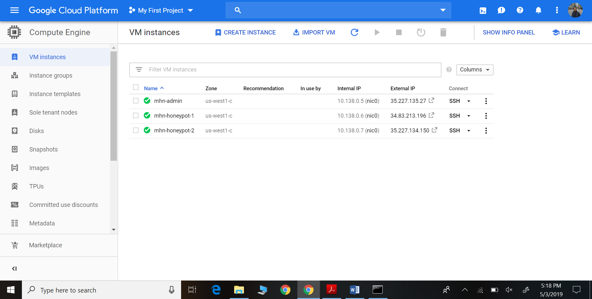
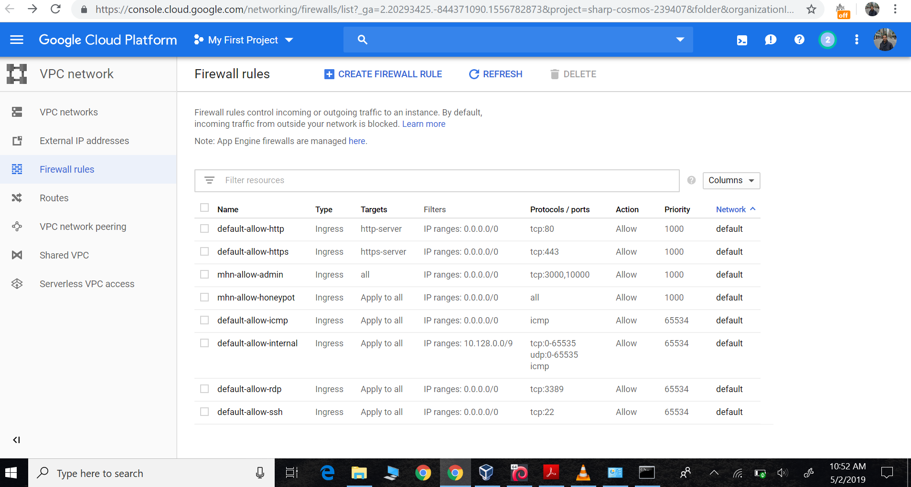
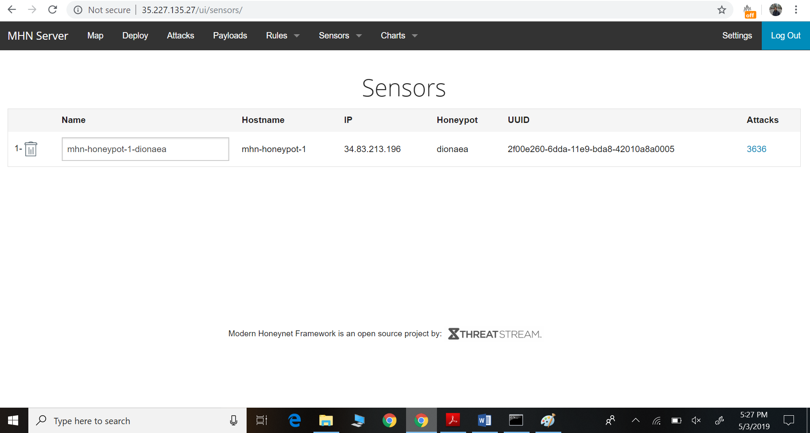
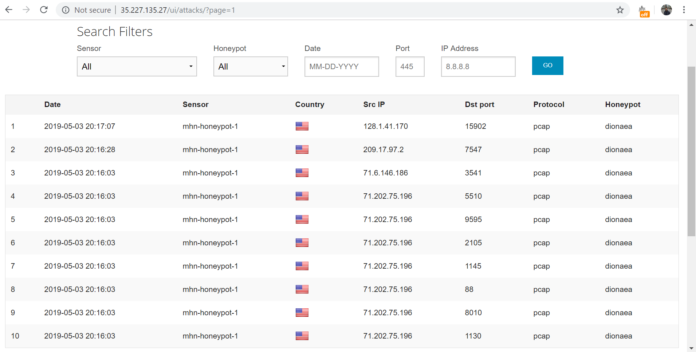

# CyberSecurity-Codepath

Assignment -10,11
Steps:

1) Setup 2 VM- MHN-admin,mhn-honeypot

2) Set Firewall Rules

3) Install MHN application in mhn-admin

4) Access MHN through External IP

5) Deploy Honeypot-1 in another VM

6) Attack the honeypot

Google Cloud Setup

Firewall Settings

Deployed Honeypot

Attacks

