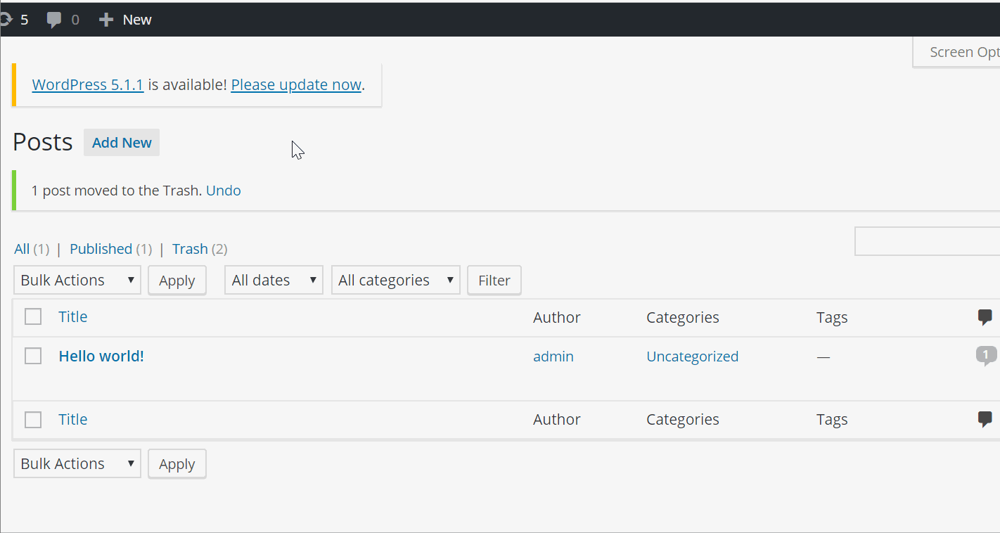

# CyberSecurity-Codepath

Assignment -7,8

Xploits:

1) Vulnerability Name or ID : USER Enumeration

Summary: This exploit allowes user to enumerate through different user names, I tested with multiple non-existing usernames, and extisting usernames. Upon knowing the valid username or usernames, it is easier to perfrom bruteforce attack.
Vulnerability types: User enumeration
Tested in version: 4.2

2) Vulnerability XSS

Summary: Admin can run XSS on the page
Vulnerability types: XSS
Tested in version: 4.2
Fixed in version: 4.6.1
Steps to recreate:
Create new page
Add the code which triggers XSS alert on load: testing_xss 

3) Stored XSS

Summary:
Vulnerability types: XSS Summary: 4.2 version of Wordpress is vulnerable to a stored XSS attack. An unauthenticated attacker can inject JavaScript code in the Wordpress comments and JS code is executed when comment is viewed by anyone.
Tested in version:4.2
Fixed in version: 4.2.1

Steps to recreate:
Add a new post with image which named as XSS alert
Add a comment to inject JS code, which should be more than 64 kb.
Click on the image, you will see an alert box.

 
